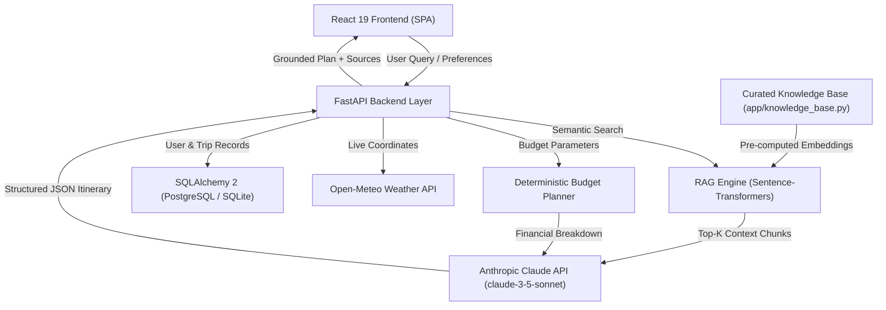

# TripGenie AI — Intelligent AI Travel Planner Using LLM and RAG

[](https://react.dev/)
[](https://vitejs.dev/)
[](https://fastapi.tiangolo.com/)
[](https://www.python.org/)
[](https://www.anthropic.com/)
[](https://huggingface.co/sentence-transformers/all-MiniLM-L6-v2)
[](https://tailwindcss.com/)
[](LICENSE)

> A modern, full-stack travel intelligence platform that combines **Large Language Models (LLM)** with **Retrieval-Augmented Generation (RAG)** and a **Deterministic Financial Engine** to generate hallucination-free itineraries, realistic budget breakdowns, live meteorological observations, and interactive GPS waypoint maps.

---

## 1. Project Overview

TripGenie AI is designed to address the key failure points of commercial travel tools: fabricated sights, unrealistic budgets, and disconnected maps. By combining high-speed dense vector retrieval (`all-MiniLM-L6-v2`) with Anthropic Claude (`claude-3-5-sonnet-20241022`), TripGenie AI produces detailed, day-by-day travel itineraries grounded in verified local documents.

Every itinerary includes transparent 5-category budget breakdowns, authentic hotel recommendations matched by proximity, live weather forecasts, interactive Leaflet maps, and an in-browser vector PDF export.

---

## 2. Problem Statement

1. **AI Hallucinations**: Standard generative AI models frequently fabricate landmarks, misrepresent travel times, or suggest closed venues.
2. **Financial Guesswork**: Most travel bots cannot calculate actual room requirements, transit tariffs, or per-person costs, resulting in misleading estimates.
3. **Information Disconnect**: Travelers are forced to juggle separate applications for itineraries, weather forecasts, maps, hotel booking, and expense tracking.

---

## 3. Key Objectives

- **Ground Generative Output**: Use an 8-stage semantic RAG pipeline to eliminate hallucinations.
- **Deterministic Budget Modeling**: Compute transparent accommodation, food, transit, activity, and reserve expenses with deficit alerts.
- **Unified Multimodal Experience**: Integrate live WMO weather station telemetry and OpenStreetMap GPS routes directly into the planning view.
- **Zero-Server Client-Side Export**: Enable travelers to download structured PDF dossiers without relying on server-side rendering bottlenecks.
- **Secure Persistence**: Offer authenticated user sessions with JWT tokens and saved trip archives.

---

## 4. Key Features Actually Implemented

- 🧭 **RAG-Grounded Itinerary Generator**: Synthesizes customized day-by-day schedules citing retrieved factual knowledge chunks with cosine similarity attribution.
- 💰 **Deterministic 5-Category Budget Planner**: Calculates exact accommodation, food, transportation, activity, and miscellaneous expenses. Detects deficits and generates cost-saving alternatives.
- 📡 **Live Meteorological Observations**: Fetches live temperature, humidity, wind, and 5-day precipitation forecasts from the Open-Meteo Global Meteorological API.
- 🏨 **Proximity-Aware Hotel Matcher**: Filters verified properties by user budget and sorts them based on physical distance to daily itinerary attractions.
- 🗺️ **Interactive Leaflet Route Maps**: Displays numbered day-route waypoints, connecting polylines, and Haversine geodesic distance calculations using OpenStreetMap / CartoDB tiles.
- 📄 **Client-Side Vector PDF Exporter**: Instant, zero-backend export of branded travel dossiers using `jsPDF` and `jspdf-autotable` with 2-pass dynamic page numbers (`Page X of Y`).
- 💬 **Context-Aware AI Travel Concierge**: Interactive chatbot grounded in current trip details and the vector knowledge base.
- 🔐 **User Accounts & Saved Trips**: Secure registration, password hashing (`bcrypt`), JWT authentication, and trip bookmarking with SQLite/PostgreSQL persistence.

---

## 5. Technology Stack

### Frontend
- **Framework**: React 19 (ESM components, hooks)
- **Tooling / Bundler**: Vite 5
- **Styling**: Tailwind CSS 3 with custom brand tokens
- **Mapping**: Leaflet.js with CartoDB Voyager tiles
- **Icons**: Lucide React
- **PDF Generation**: jsPDF & jspdf-autotable (100% client-side)
- **HTTP Client**: Axios with interceptors and error normalization

### Backend
- **Framework**: FastAPI 0.115+ (Python 3.11+)
- **Server**: Uvicorn (ASGI)
- **Validation**: Pydantic v2
- **Vector Retrieval**: Sentence-Transformers (`all-MiniLM-L6-v2`, 384 dimensions)
- **Numerical Operations**: NumPy
- **Generative AI**: Anthropic Claude API (`claude-3-5-sonnet-20241022`)
- **Database / ORM**: SQLAlchemy 2 with SQLite fallback & PostgreSQL compatibility
- **Security**: Passwords hashed with `bcrypt`, access tokens via `PyJWT` (HS256)

---

## 6. System Architecture



---

## 7. RAG Workflow

```text
User Query (Destination, Days, Budget, Interests)
     │
     ▼
FastAPI Backend (/api/plan-trip)
     │
     ▼
Query Normalization & Intent Extraction
     │
     ▼
Dense Embedding Generation (all-MiniLM-L6-v2, 384 dimensions)
     │
     ▼
Cosine Dot-Product Vector Search against Document Matrix
     │
     ▼
Destination Relevance & Category Boosting (+0.15 score)
     │
     ▼
Top-K Relevant Travel Chunks Retrieved (with similarity scores)
     │
     ▼
Prompt Injection into Anthropic Claude LLM
     │
     ▼
Structured JSON Output Validation
     │
     ▼
Frontend Rendered Itinerary + Grounding Evidence Drawer
```

---

## 8. Project Directory Structure

```text
TripGenie-AI/
├── backend/
│   ├── app/
│   │   ├── __init__.py
│   │   ├── auth.py              # Password hashing & JWT authentication
│   │   ├── budget_planner.py    # 5-category deterministic budget engine
│   │   ├── config.py            # Environment & secrets configuration
│   │   ├── database.py          # SQLAlchemy engine & session manager
│   │   ├── db_models.py         # User, Trip, Itinerary, SavedPlace models
│   │   ├── hotels_database.py   # Verified hotel database & proximity scorer
│   │   ├── knowledge_base.py    # Curated travel document corpus
│   │   ├── llm.py               # Anthropic Claude prompt orchestration
│   │   ├── main.py              # FastAPI endpoints & CORS configuration
│   │   ├── models.py            # Pydantic request/response schemas
│   │   ├── pdf_exporter.py      # Optional server-side ReportLab PDF exporter
│   │   ├── rag.py               # 8-stage RAG semantic search pipeline
│   │   └── weather.py           # Open-Meteo meteorological client
│   ├── .env.example             # Backend environment variable template
│   ├── Dockerfile               # Production container definition
│   └── requirements.txt         # Declared Python dependencies
├── frontend/
│   ├── public/                  # Static assets & favicon
│   ├── src/
│   │   ├── components/          # UI components (TripForm, Itinerary, Map, etc.)
│   │   ├── services/
│   │   │   ├── api.js           # Centralized Axios client & error normalizer
│   │   │   ├── destinationsData.js # Destination catalog fallback
│   │   │   ├── locationService.js  # Haversine spatial calculation service
│   │   │   └── pdfExporter.js   # Client-side jsPDF vector exporter
│   │   ├── App.jsx              # Main application root
│   │   ├── index.css            # Tailwind directives & theme tokens
│   │   └── main.jsx             # React DOM root
│   ├── .env.example             # Frontend environment variable template
│   ├── package.json             # NPM dependencies and scripts
│   ├── tailwind.config.js       # Design tokens & color palettes
│   ├── vercel.json              # Vercel SPA routing configuration
│   └── vite.config.js           # Vite build configuration
├── docs/                        # Technical Documentation
│   ├── API.md                   # Complete REST API reference
│   ├── ARCHITECTURE.md          # Architectural deep-dive & diagrams
│   ├── PROJECT_SUMMARY.md       # Final-year project evaluation summary
│   ├── RAG.md                   # In-depth RAG pipeline documentation
│   └── SETUP.md                 # Detailed local developer setup guide
├── DEPLOYMENT.md                # Cloud production deployment instructions
├── render.yaml                  # Render infrastructure-as-code blueprint
└── README.md                    # Project overview & documentation
```

---

## 9. Quickstart: Local Development

### 9.1 Prerequisites
- Python 3.10+ or 3.11+
- Node.js 18+ or 20+
- Anthropic Claude API Key

### 9.2 Backend Setup
```bash
cd backend
python -m venv venv

# Windows:
.\venv\Scripts\Activate.ps1
# Linux/macOS:
source venv/bin/activate

pip install -r requirements.txt
cp .env.example .env
# Edit .env and insert your ANTHROPIC_API_KEY

uvicorn app.main:app --reload --host 127.0.0.1 --port 8000
```
Backend runs at: **`http://127.0.0.1:8000`** (Swagger docs at `/docs`).

### 9.3 Frontend Setup
```bash
cd frontend
npm install
cp .env.example .env
# VITE_API_URL=http://127.0.0.1:8000/api

npm run dev
```
Frontend runs at: **`http://localhost:5173`**.

---

## 10. Actual Implemented API Endpoints

| Method | Path | Description |
|---|---|---|
| `GET` | `/` | Root status metadata |
| `GET` | `/health` & `/api/health` | System health check & loaded destinations |
| `GET` | `/api/destinations` | Catalog of destinations in knowledge base |
| `GET` | `/api/weather` | Live meteorological data & 5-day forecast |
| `GET` | `/api/activities/{dest}` | Available activities catalog with verified tariffs |
| `POST` | `/api/calculate-budget` | 5-category deterministic budget computation |
| `POST` | `/api/plan-trip` | RAG-grounded itinerary synthesis via Claude LLM |
| `POST` | `/api/chat` | Conversational travel assistant with RAG citations |
| `GET` | `/api/hotels` | Verified hotel properties catalog |
| `POST` | `/api/hotels/recommend` | Proximity-aware accommodation recommendation engine |
| `POST` | `/api/auth/register` | User registration with bcrypt & JWT token issuance |
| `POST` | `/api/auth/login` | User authentication & JWT issuance |
| `GET` | `/api/auth/me` | Current authenticated user profile |
| `POST` | `/api/trips` | Save trip to database |
| `GET` | `/api/trips` | List user's saved trips |
| `GET` | `/api/trips/{id}` | Retrieve saved trip detail |
| `DELETE` | `/api/trips/{id}` | Delete saved trip record |
| `POST` | `/api/export/pdf` | Server-side vector PDF stream |

*For full request/response schemas, see [docs/API.md](docs/API.md).*

---

## 11. Client-Side PDF Export Functionality

TripGenie AI includes a high-performance, client-side PDF export engine in [`frontend/src/services/pdfExporter.js`](frontend/src/services/pdfExporter.js):
- **Zero Server Overhead**: Compiles the travel dossier directly in the user's browser using `jsPDF` and `jspdf-autotable`.
- **Formatting**: Full Indian currency formatting (`₹`), styled tabular daily breakdowns, accommodation cards, and curated travel tips.
- **Dynamic Pagination**: Two-pass canvas renderer calculates total page counts (`Page X of Y`).
- **Standardized Filename**: Formatted dynamically as `TripGenie_<Destination>_<Days>Days_Itinerary.pdf`.

---

## 12. Screenshots

> *Placeholder: Screenshots can be captured from the local preview server (`http://127.0.0.1:4173/`).*

| Feature | Screenshot |
|---|---|
| **Trip Planning Interface** |  |
| **Grounded Daily Itinerary** |  |
| **5-Category Budget Engine** |  |
| **Interactive GPS Map** |  |
| **Exported PDF Dossier** |  |

---

## 13. Limitations

1. **Catalog Scope**: The high-precision RAG vector store is currently indexed for 5 major Indian tourist regions (Goa, Jaipur, Kerala, Manali, Rishikesh).
2. **In-Memory Vector Matrix**: Embeddings are indexed in a normalized NumPy matrix; enterprise horizontal scaling beyond 50,000 documents requires dedicated vector databases (e.g. pgvector or Qdrant).
3. **Knowledge Ingestion**: Updates to the knowledge base require re-indexing at server startup rather than live internet web scraping.

---

## 14. Future Scope

- 🌐 **Global Destinations**: Expand knowledge corpus to include international hubs (Tokyo, Paris, Dubai, London).
- ✈️ **Live Booking Integrations**: Direct API integration with GDS/booking providers (IRCTC, Amadeus) for live flight and rail availability.
- 👥 **Collaborative Planning**: Multi-user real-time itinerary editing via WebSockets.
- 📱 **Progressive Web App (PWA)**: Complete offline caching of saved itineraries on mobile devices.

---

## 15. License

This project is licensed under the **MIT License** — see the [LICENSE](LICENSE) file for details.
