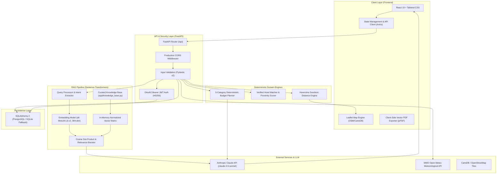

# System Architecture — TripGenie AI

TripGenie AI is an intelligent, RAG-grounded travel planning system designed to eliminate LLM hallucinations, deliver realistic deterministic budget calculations, provide verified GPS waypoints, and stream live meteorological data.

---

## 1. High-Level Architecture Diagram

---

## 2. Component Architecture Breakdown

### 2.1 Frontend Architecture
- **Framework**: React 19 Single-Page Application (SPA).
- **Bundler & Tooling**: Vite 5 for fast HMR and tree-shaken production bundles.
- **Styling & Design System**: Tailwind CSS with tailored color tokens (`brand`, `sand`, `ink`), smooth transitions, and responsive containers.
- **Mapping & Spatial Visualization**: Leaflet.js with CartoDB Voyager and OpenStreetMap tiles, rendering custom day-colored waypoint pins.
- **Client-Side PDF Generator**: Pure frontend PDF engine (`frontend/src/services/pdfExporter.js`) built with `jsPDF` and `jspdf-autotable`. Generates branded travel dossiers with 2-pass dynamic page numbers (`Page X of Y`), exact 182mm table width matching, and Indian currency formatting (`₹`).

### 2.2 Backend & API Layer
- **Framework**: FastAPI (Python 3.11+) ASGI application.
- **Server Engine**: Uvicorn with asynchronous request handlers.
- **Data Validation**: Pydantic v2 schemas enforcing strict bounds on input types, traveler counts (1–20), duration (1–14 days), and realistic budget minimums (₹2,000+).
- **CORS Middleware**: Configured dynamically via `CORS_ORIGINS` to allow secure communication with deployed frontend domains.
- **Health Check Endpoints**: Dual health check endpoints (`/health` and `/api/health`) enabling compatibility with Docker, Kubernetes, Render, and cloud load balancers.

### 2.3 Retrieval-Augmented Generation (RAG) Pipeline
The RAG pipeline grounds the generative LLM in real-world travel information, eliminating hallucinations of non-existent attractions, closed landmarks, or fictitious transport options:
1. **Knowledge Base (`app/knowledge_base.py`)**: Structured collection of curated travel documents covering major Indian tourist destinations (Goa, Jaipur, Kerala, Manali, Rishikesh).
2. **Embedding Model (`sentence-transformers/all-MiniLM-L6-v2`)**: Generates dense 384-dimensional semantic vector embeddings for both knowledge chunks and incoming user queries.
3. **In-Memory Vector Matrix**: Normalized float32 NumPy array storing document embeddings.
4. **Vector Search**: Sub-millisecond cosine similarity calculated via vector dot-product:
   $$\text{Cosine Similarity} = \mathbf{u} \cdot \mathbf{v}$$
5. **Relevance Boosting**: Chunks matching the target destination and query categories receive an algorithmic relevance boost (+0.15).
6. **Top-K Retrieval**: Extracts the top $k=6$ to $8$ highest scoring knowledge chunks along with provenance metadata.
7. **Prompt Synthesis**: Retrieved chunks are injected as bullet points into the system prompt of Anthropic Claude.

### 2.4 Deterministic Budget Engine (`app/budget_planner.py`)
Unlike traditional AI trip planners that guess travel costs, TripGenie AI implements a deterministic financial calculation engine:
- Computes costs across 5 distinct categories: **Accommodation**, **Food**, **Transportation**, **Activities**, and a 7% **Miscellaneous Reserve**.
- Factors in traveler count, nights required, vehicle capacity, and activity tariffs.
- Calculates exact budget utilization percentages and automatically suggests actionable cost-saving alternatives when a user's budget is exceeded.

### 2.5 Spatial & Proximity Engine (`app/hotels_database.py` & `services/locationService.js`)
- Registry of verified GPS coordinates for all landmark attractions.
- Calculates Haversine geodesic distances and estimated road transit times between itinerary waypoints:
  $$d = 2r \arcsin\left(\sqrt{\sin^2\left(\frac{\Delta \phi}{2}\right) + \cos(\phi_1)\cos(\phi_2)\sin^2\left(\frac{\Delta \lambda}{2}\right)}\right)$$
- Scores and sorts hotel recommendations by physical proximity to the user's daily itinerary attractions.

### 2.6 Persistence Layer (`app/database.py`)
- **ORM**: SQLAlchemy 2.
- **Dual-Mode Connectivity**:
  - Automatically connects to managed PostgreSQL if `DATABASE_URL` is set (Render, Railway, Supabase).
  - Transparently falls back to local persistent SQLite (`sqlite:///./tripgenie.db`) for zero-config offline development.
- **Schema**: Tables for `User`, `Trip`, `Itinerary`, `SavedPlace`, and `UserPreference`.
- **Security**: Passwords hashed with `bcrypt` (zero plaintext storage); authentication tokens issued via `PyJWT` (HS256).

### 2.7 External Services Integration
- **LLM**: Anthropic Claude Messages API (`claude-3-5-sonnet-20241022`) for natural language itinerary generation and conversational chat.
- **Weather API**: Open-Meteo Global Meteorological API (WMO station observations and 5-day forecasts) queried via real-time coordinates.
- **Map Tiles**: CartoDB Voyager and OpenStreetMap CDN.
