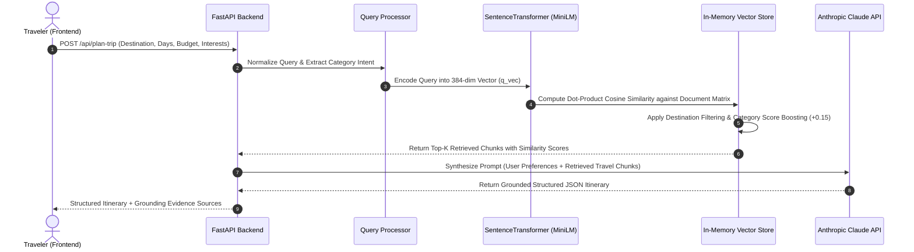

# Retrieval-Augmented Generation (RAG) Architecture — TripGenie AI

## 1. What is RAG?

**Retrieval-Augmented Generation (RAG)** is an artificial intelligence framework that combines the reasoning and natural language synthesis capabilities of a Large Language Model (LLM) with a specialized external retrieval mechanism. 

Instead of relying solely on parametric knowledge memorized during an LLM's pre-training, RAG dynamically retrieves authoritative, domain-specific text chunks from an external knowledge base at inference time and injects them into the model's prompt context.

---

## 2. Why TripGenie AI Uses RAG

General-purpose LLMs exhibit significant drawbacks when planning real-world travel itineraries:
1. **Hallucination of Places**: LLMs frequently invent non-existent attractions, combine features of distant locations, or suggest closed monuments.
2. **Temporal Degradation**: Operating hours, entry fees, and travel seasons change, rendering static LLM pre-training data outdated.
3. **Unverifiable Claims**: Traditional LLM responses do not provide traceable provenance or verifiable sources.

TripGenie AI solves these issues by grounding Claude 3.5 Sonnet in an curated travel knowledge base, ensuring every recommended sight, timing, and entry ticket reflects authentic data with similarity score attribution.

---

## 3. RAG Pipeline Architecture



---

## 4. Knowledge Source & Document Chunking

### 4.1 Knowledge Base Structure (`app/knowledge_base.py`)
The primary knowledge source consists of curated, high-density travel documents covering key regions (Goa, Jaipur, Kerala, Manali, Rishikesh).

Each knowledge chunk is structured with granular metadata:
```python
{
    "id": "goa_attraction_aguada",
    "destination": "Goa",
    "category": "attractions",
    "place_name": "Fort Aguada & Lighthouse",
    "text": "Fort Aguada is a 17th-century Portuguese fort standing on Sinquerim Beach overlooking the Arabian Sea. It features a freshwater spring and a 4-storey lighthouse built in 1864. Open daily 9:30 AM to 5:30 PM. Entry fee: ₹25 for Indians, ₹300 for foreigners. Ideal for sunset photography and coastal views.",
    "tags": ["heritage", "coastal", "history", "photography", "sunset"],
}
```

### 4.2 Document Chunking Strategy
- **Granularity**: Chunked at the individual attraction or specific experiential level (100–180 words per chunk).
- **Semantics**: Preserves self-contained facts: landmark name, geographical area, operational timings, entry fees, and local insider advice.
- **Categorization**: Tagged into standard travel categories: `attractions`, `food`, `stay`, `budget`, and `tips`.

---

## 5. Embeddings & Vector Storage

### 5.1 Embedding Model
- **Model**: `sentence-transformers/all-MiniLM-L6-v2`
- **Output Dimensionality**: 384 dense floating-point dimensions.
- **Characteristics**: Fast inference on CPU (~15ms per query), optimized for semantic sentence similarity and asymmetric retrieval.

### 5.2 In-Memory Vector Storage (`app/rag.py`)
At server startup, the `RAGEngine` initializes the vector index:
1. All document texts are pre-encoded into a 2D NumPy array:
   $$\mathbf{M} \in \mathbb{R}^{N \times 384}$$
2. Vector embeddings are normalized using Euclidean $L_2$ norm:
   $$\mathbf{v}_{\text{norm}} = \frac{\mathbf{v}}{\|\mathbf{v}\|_2}$$
3. Because vectors are unit-normalized, cosine similarity simplifies to matrix-vector multiplication:
   $$\mathbf{s} = \mathbf{M} \cdot \mathbf{q}_{\text{norm}}$$
   This provides microsecond similarity search times on commodity hardware without requiring heavyweight external vector database services.

---

## 6. Retrieval & Context Grounding Process

### 6.1 Query Processing & Intent Extraction
Incoming user requests (e.g. *"4-day trip to Goa with water sports and heritage"*) pass through `QueryProcessor`:
- Cleans punctuation and normalizes whitespace.
- Identifies destination entities (e.g. `Goa`).
- Detects category keywords to prioritize relevant chunks (`attractions`, `food`, `tips`).

### 6.2 Destination Relevance Boosting
To ensure absolute spatial relevance, chunks undergo algorithmic score boosting:
```python
if chunk_dest.lower() == target_dest.lower():
    boosted_score += 0.15  # Spatial affinity boost
if chunk_cat in query_categories:
    boosted_score += 0.05  # Intent match boost
```

### 6.3 Prompt Injection into the LLM
The top $k=8$ retrieved chunks are formatted into structured text:
```markdown
RETRIEVED KNOWLEDGE BASE GROUNDING:
- [Fort Aguada & Lighthouse | attractions] (Sim: 84.2%): Fort Aguada is a 17th-century Portuguese fort... Entry fee: ₹25...
- [Baga Beach | attractions] (Sim: 81.6%): Baga Beach is famous for water sports including parasailing...
- [Britto's Shack | food] (Sim: 78.4%): Famous beach shack serving authentic Goan seafood curries...
```
This context is injected into Anthropic Claude's prompt with strict system instructions:
- Use retrieved landmarks, timings, and ticket prices as factual ground truth.
- Do not fabricate locations not present in the region.
- Return output strictly matching the expected JSON schema.

---

## 7. Limitations of the Current RAG Implementation

1. **In-Memory Storage**: Storing vectors in an in-memory NumPy matrix is ultra-fast for thousands of documents, but horizontal scaling beyond tens of thousands of chunks would require an external vector database (e.g., pgvector, Qdrant, or Pinecone).
2. **Curated Catalog Scope**: The knowledge base is currently indexed for 5 major Indian destination regions. Querying an unindexed destination falls back to general LLM parametric knowledge.
3. **Static Ingestion**: Document updates require re-encoding the index at process startup rather than continuous real-time crawling.
